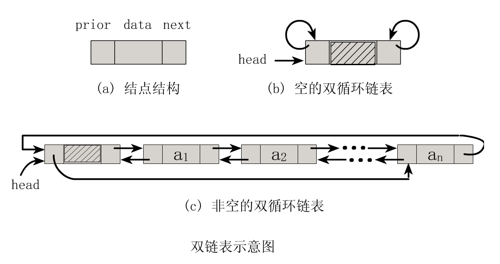
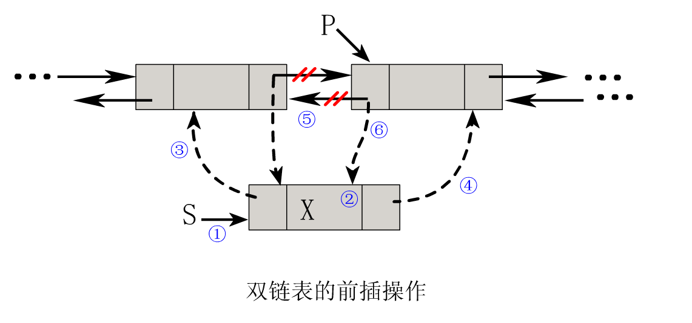
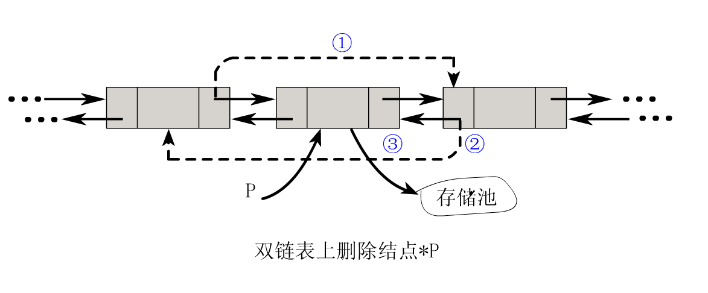

# 循环双链表的js实现

- author: pdap
- usage:  all

------

循环双链表的js实现，提供头插尾插，按位查询，按值查询

------

 
## 使用方法
````javascript
 /**
  * [DuLNode 循环双链表的js实现]
  * @param {number||string}   pos   指针
  * @param {object||array||sting||number}   data  数组中的元素
  * @param {DuLNode}   prior 双链前驱结点
  * @param {DuLNode} next  双链后置结点
  */
(function (name, context, factory) {

  // 支持 UMD. AMD, CommonJS/Node.js   
  if (typeof module !== "undefined" && module.exports) {
    module.exports = factory();
  } else if (typeof define === "function" && define.amd) {
    define(factory);
  } else {
    context[name] = factory();
  }

})("DuLNode", this, function () {
 
    function DuLNode(pos,data, prior, next) {
    this.data = data||null; //数据
    this.pos  = pos;        //指针 
    this.prior = prior || this; // 前驱
    this.next = next|| this;  // 后继
  }
  DuLNode.prototype = {
    // 按位查找
    findByPos:function(pos){
       var p = this.next;       
      // 从当前指针向后查找，直到p为空或者指针为pos，或者指针扫描到自身
      while (p && p!==this&&p.pos!==pos) {
        p = p.next;
      }
       return (!p || p.pos!==pos) ? null : p;
    },
    // 按值查找
    findByValue:function(value){
       var p = this.next;       
    
      while (p && p!==this&&p.data!==value) {
        p = p.next;
      }
       return (!p || p.data!==value) ? null : p;
    },
    // 头插法
    insertAfter: function (pos,npos, elem) {
      var p;

      if (!(p = this.findByPos(pos))) return false;

      var s = new DuLNode(npos,elem,p,p.next);
      p.next.prior = s;
      p.next = s;

      return true;
    },
        // 尾插法
     insertBefore: function (pos, npos,elem) {
      var p;

      if (!(p = this.findByPos(pos))) return false;

      var s = new DuLNode(npos,elem, p.prior, p);
      p.prior.next = s;
      p.prior = s;
      return true;
    },
    // 头插追加
    addAfter:function(pos,data){
    	var p =this;

      var s = new DuLNode(pos,data, p, p.next);
      p.next.prior=s;
      p.next = s;
    },
    // 尾插追加
    addBefore:function(pos,data){
        var p =this;
    	//console.log(p);
      var s = new DuLNode(pos,data, p.prior, p);
      p.prior.next=s;
      p.prior = s;
    },
    // 按位删除元素
    listDelete: function (i) {
      var p;
      if (!(p = this.findByPos(i))) return false;
      var e = p.data;
      p.prior.next = p.next;
      p.next.prior = p.prior;

      p = null;

      return e;
    }
  };
  return DuLNode;
});
/**
 * 以数组的第一个元素作为头结点建立循环双链表
 * @param  {[Array]} arr [待处理数组元素]
 * @return {[Object]} DuLNode  [循环双链表]
 */
  function arr2LList(arr){
   var  llist = null;
   for (var i = 0; i < arr.length; i++) {
    if (llist===null) {
       llist = new DuLNode(i,arr[i]) ;
     } else{
       llist.addBefore(i,arr[i]);
     }	
   }
   return llist;
  }
 var test = arr2LList([1,2,3,4,5,6,7,8,9,10]);
 console.log(test,test.next,test.next.next,test.prior,test.prior.prior,test.findByValue(10),test.findByPos(0));
````
## 参考资料
> [循环双链表](http://www.nowamagic.net/librarys/veda/detail/1876)
> 
> 
> 

------